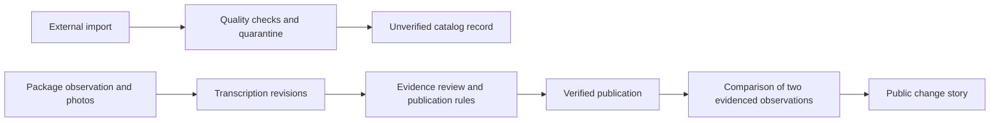

# LinkedIn launch readiness — 3 September 2026

**Recommendation:** complete a focused trust-and-evidence release before promoting EtikettKontroll as a reviewed food database. The current stack is suitable for a small launch. The blocking work is publication integrity, provenance, and demonstrating actual packaging changes.

## Scope and verification

- Ran `git pull --ff-only`: already up to date on `main`, commit `1a1a44b`.
- Reviewed the Prisma schema, submission/review/import paths, public queries, authentication, routing, caching, deployment scripts, and relevant existing tests.
- Inspected production anonymously in a browser and through public GET requests. `/api` reported version `0.2.1`, a working database, and 355 products. It does not expose a commit SHA, so exact deployment/source equivalence is unconfirmed.
- Ran `node node_modules/typescript/bin/tsc --noEmit --incremental false`: failed because the websocket examples reference missing `socket.io` and `socket.io-client` modules. The Bun API suite was not run; Bun was not available on PATH or at the checked user install location. Production credentials were displayed but were not used to sign in.
- This review adds documentation only. Production configuration, account validity, backup schedules, and restore capability were not inspected.

## What the earlier findings look like now

| Earlier concern | Current evidence | Assessment |
| --- | --- | --- |
| Imports presented as reviewed | The imported Soba product has an explicit unreviewed badge, but imports remain `auto_approved`, appear under “Latest reviewed changes,” and contribute to the homepage's 360 reviewed-change count. Search returns no provenance or verification state. | Partially addressed in one component; still a launch blocker. |
| Nutrition/allergen claims without evidence | Soba's public API reports zero reviewers and no ingredient/nutrition photos. Its page displays nutrition and runs ingredient highlighting on visibly damaged Romanian text; the detector supports English/Swedish keywords. | Still present. |
| Publication without evidence or despite disputes | Photo values are optional. Automatic publication bypasses review. The approval branch never checks unresolved rejection votes. | Still present; recent nutrition shortcuts widen the gap. |
| Demo and production mixed | Production's sign-in dialog displays demo moderator accounts and their shared password. The activity feed includes identities and examples found in the seed script. Production seeding is off by default, but can still be enabled. | Still present. Whether the advertised passwords currently authenticate was not tested. |
| Imported data quality | Import validation checks basic format, lengths and broad numeric bounds, but lacks quarantine, language/evidence qualification and structured provenance. | Still present. |
| Hydration, loading, counts, metadata, 404 | Direct product loading emitted React error 418. Server HTML showed “1 september 2026”; the browser showed 2 September. Unknown product returned HTTP 404; arbitrary unknown route returned homepage/200. Counts exclude superseded revisions. Client navigation retained the previous document title. | Several concrete defects remain; product 404 is improved. No permanent spinner was observed during successful requests. |
| Mobile/accessibility | At 390 px, document width was 399 px. Header icon targets were 36 px, scanner 32 px, language controls 24 px high. Product-card accessible names repeat the product name. | Still worth fixing before a mobile-heavy announcement. |

Live examples: [homepage](https://etikettkontroll-production.up.railway.app/), [Soba import](https://etikettkontroll-production.up.railway.app/product/5997523312152), [Lindahls history](https://etikettkontroll-production.up.railway.app/product/7392672001403).

## Architectural priorities

### 1. Make provenance, verification and publication independent

The current `ProductRevision.status` combines review outcome with whether a revision is current. `auto_approved` covers both imports and trusted-user submissions; `superseded` then replaces the previous approval state. A free-text `autoNote` carries facts that should be structured.

This already causes incorrect labeling: `product-view.tsx:368` treats any `autoNote` without reviewers as an Open Food Facts import. The live Lindahls revision is a moderator submission with zero reviews and such a note, so this rule misclassifies it.

Introduce explicit fields/relations:

- `sourceType`: human, Open Food Facts, demo; source record URL/ID, import timestamp, source revision when available, and separate data/image license metadata.
- `verificationState`: unverified, pending, verified, disputed, rejected; retain review history and the policy version used for a decision.
- Publication identity: an append-only publication record and a `Product.currentPublicationId` pointer. Replacing the pointer must preserve earlier publication and verification history.
- A shared public response shape containing source, verification state, evidence coverage and relevant timestamps. Search, detail, feeds, counts and metadata must consume the same policy.

Imports can be discoverable as clearly labeled unverified records after basic quality checks. They must not become verified simply to avoid filling the review queue. Hide unverified nutrition/allergen summaries by default or put them behind an explicit raw-import disclosure; never render an absence of keyword matches as absence of allergens.

References: `prisma/schema.prisma:72`, `src/lib/off-import.ts:250`, `src/lib/search.ts:134`, `src/components/ek/product-view.tsx:363`.

### 2. Enforce a single publication boundary

Currently there are separate publication paths in the importer, submission service and review endpoint. `publishRevision()` itself has no evidence checks. The latest trust change explicitly auto-publishes a newcomer's single nutrition-field correction; L1 can auto-publish any single-field correction, including ingredients, and L2+ can publish everything. Existing tests deliberately assert the newcomer behavior.

For launch, remove those bypasses for label facts. A small group of explicitly appointed reviewers can handle early contributions. Reputation may prioritize work; it should not substitute for evidence or confer administrator authority automatically.

All verified publication should pass one transactional service which checks:

1. Required ingredient/nutrition/package evidence exists, can be read, and has been reviewed for the specific claims.
2. Reviewer eligibility, independence from the submitter, and the required approvals.
3. No unresolved dispute. A moderator resolution must be a recorded decision with a reason, not an approval that silently ignores a rejection.
4. The submitted `baseRevisionId` still matches the current publication. Otherwise require conflict resolution before replacing the full snapshot.
5. Publication, the current pointer, denormalized search fields and any reward events update atomically and idempotently.

There is also an immediate baseline bug: submissions diff only against `status: 'approved'`, while detail pages accept both approved statuses. After an automatic publication, subsequent edits can be diffed against no current revision or an older approved one. Use one canonical current-publication lookup.

References: `src/lib/revisions.ts:74`, `:137`, `:150`, `:162`; `src/app/api/revisions/[id]/review/route.ts:108`; `tests/api/trust-bootstrap.test.ts`.

### 3. Model physical observations separately from database corrections

An immutable edit log does not prove a manufacturer changed a package. A protein value changing from 9 to 11 could be a transcription correction, a newly observed label, or an unsupported edit. The current schema cannot express that distinction. `createdAt` and `finalizedAt` tell us when the database was edited, not when packaging changed.

Add an observation model that records:

- The package/variant and barcode, market, observation date or date interval, and evidence source. Keep observed, uploaded, imported and reviewed timestamps separate; unknown dates remain unknown.
- Structured net quantity, unit and multipack count. `servingSize` is not package quantity. Record nutrition basis explicitly, including per 100 g versus per 100 ml and prepared versus sold when applicable.
- Evidence objects with immutable file identifiers/hashes, image role, uploader/source, attribution and review coverage. Validate image bytes and dimensions; a plausible `/uploads/...` path alone proves neither existence nor relevance.
- A reviewed link between comparable variants when a size change receives a new barcode. Do not infer this link solely from similar names.

Keep revisions as transcriptions/corrections of observations. Create a separate change claim linking two evidenced observations, with `changeKind` such as quantity, formulation or nutrition. Database corrections belong in the audit history but should not automatically become consumer-facing packaging-change claims.

For launch, demonstrate three to five real before/after cases with legible photos and honest date uncertainty. Quantity reduction can be stated without prices; claims about price increases or value require comparable price observations, with date, retailer, currency and promotion context. Do not substitute seeded examples for that evidence.

Reference: `prisma/schema.prisma:59` onward.

### 4. Separate production identity and moderation from demo convenience

Remove demo sign-ins from the production bundle, audit the actual production demo accounts, disable their access and invalidate any affected sessions. Exclude demo records from real community statistics and featured evidence. Preserve material needed for an audit before changing existing records.

Replace public-registration bootstrap with an operator-controlled setup command or explicit account allowlist. `bootstrapFirstModerator()` grants authority whenever it cannot find a cached L3 user; it does not verify that the recipient is the operator or that this is literally the first account. An Open Food Facts bot also has an L3 cache value, complicating this mechanism further.

Use an explicit moderator role with grant/revoke history, separate from earned reputation. Establish verified email before contributor actions that rely on account identity; the current email flag is informational and does not gate submission/review. Retain the production requirement for a session secret, which is a useful existing safeguard.

References: `src/components/ek/auth-dialog.tsx:311`, `src/lib/trust.ts:85`, `src/app/api/auth/register/route.ts`, `src/lib/verify-email.ts`, `src/lib/seed-demo.ts`.

### 5. Migrate and qualify existing data before fixing the badge text

A code-only change leaves the existing auto-approved database untouched. Use a repeatable, dry-run-first migration with a backup and a reconciliation report:

- Classify known imports and demo records; mark uncertain legacy provenance explicitly rather than inferring human verification from a status or note.
- Preserve source snapshots and transformation details. Quarantine malformed ingredient text and impossible/incomparable values. Unsupported languages can remain source text, but must not feed a detector that does not support them.
- Re-evaluate evidence and review coverage for existing records; do not automatically grandfather them into verified status.
- Rebuild public search and statistics from the qualified records. Today the search triggers index every Product, including products with only pending or rejected revisions.
- Give counts explicit meanings: catalog records, verified observations, published packaging changes, and human contributors. Keep imports and bots out of human-review totals.

The feed currently selects only `approved` and `auto_approved`. Once a revision is superseded, its event disappears. Lindahls has four revisions but search returns `approvedCount: 1`. An append-only publication/change feed resolves this without conflating current state and historical events.

Fix licensing metadata too: the importer says OFF data is CC BY-SA 4.0. OFF documents separate licenses for its database (ODbL), individual contents (DbCL), and product images (CC BY-SA). Preserve the actual license and attribution for each source and review the applicable reuse terms before redistributing the combined database. [Official OFF licensing documentation](https://openfoodfacts.github.io/documentation/docs/Product-Opener/api/tutorials/license-be-on-the-legal-side/).

References: `src/lib/off-import.ts:34`, `:98`; `src/lib/search.ts:106`, `:279`; `src/app/api/changes/route.ts:20`; `src/app/api/stats/route.ts:13`.

### 6. Finish the public delivery path and operational checks

Keep Next.js, Prisma and the single-service architecture. SQLite can remain a deliberate initial deployment choice with a single writer instance and verified persistence/recovery. PostgreSQL, distributed queues and microservices are not prerequisites for this launch. Move to managed database/object storage when availability, multiple app instances or storage volume justify it.

Before announcement:

- Adopt real Next routes/links incrementally, or explicitly fix the custom router's unknown-path behavior and metadata updates. The current catch-all defaults unknown paths to home and History API navigation leaves document metadata behind.
- Use deterministic date/timezone formatting for SSR and initial hydration. The observed server/browser date difference is a concrete mismatch consistent with the emitted [React hydration error 418](https://react.dev/errors/418); verify the fix rather than suppressing warnings.
- Add timeout, error and retry states for public requests. Homepage request failures are swallowed, leaving `stats` null and its skeleton visible indefinitely; this failure path remains even though normal loading succeeded during this review.
- Make offline state and last-checked time explicit. The service worker replays product HTML on failure, while `ProductView` skips its initial fetch when SSR data exists. Cached verification could therefore survive a later dispute without a freshness signal. Until this is handled, disable offline replay of product facts or clearly identify them as cached and revalidate on reconnect.
- Fix the mobile overflow, target sizes and duplicated accessible names. Make the first shared product/change page look correct on a phone and verify its Swedish Open Graph preview.
- Remove `ignoreBuildErrors: true` after making type checking pass. Remove/exclude unused websocket examples or declare their required dependencies. Add CI gates for types, the existing API suite, and a focused production-build/browser smoke test.
- Introduce versioned migrations; `db:push` currently uses `--accept-data-loss`, and no Prisma migration history is committed. Confirm the actual Railway startup path, persistent DB/photo paths, backup schedule and one successful restore. The checked-in packaging helper can copy a preview database, but its use on this Railway deployment was not established.
- Expose the deployed commit in health diagnostics and monitor availability/errors so the reviewed source can be matched to the release.

References: `src/lib/route.ts:49`, `:102`; `src/lib/router.ts:86`; `src/components/ek/home-view.tsx:23`; `public/sw.js:103`; `src/components/ek/product-view.tsx:285`; `next.config.ts:33`; `package.json:11`; `.zscripts/database-runtime-build.sh`.

## Suggested release sequence and acceptance criteria

| Release step | Required result |
| --- | --- |
| 1. Production trust boundary | Demo access removed/audited; operator-assigned moderation; automatic label-fact publication disabled; claims in the homepage, metadata and verification page match actual behavior. |
| 2. Evidence and migration | Source/review/publication separation, evidence gate, conflict handling, legacy classification, corrected licenses, rebuilt search and meaningful counts. |
| 3. Demonstrable value | Observation dates and net quantity; three to five independently checked before/after stories; corrections clearly distinguished from real packaging changes. |
| 4. Public beta readiness | Passing release gates, deterministic rendering, mobile/share checks, explicit stale/error states, restore proof and basic monitoring. |

The most valuable automated acceptance cases are: an import never gains a reviewed label anywhere; missing evidence blocks every verified publication path; a rejection remains blocking until resolved; a stale-base submission cannot overwrite a newer publication; replacing the current publication does not erase prior events; and a transcription correction is not advertised as a physical product change. Add a cache/reconnect test if offline product pages remain enabled.

After these gates, announce a focused public beta seeking contributors and reviewers, centered on a real evidenced change. Broader catalog coverage, automated price collection, more OCR providers and infrastructure expansion can follow. The launch story should demonstrate **what changed, when it was observed, and the evidence supporting it**.
